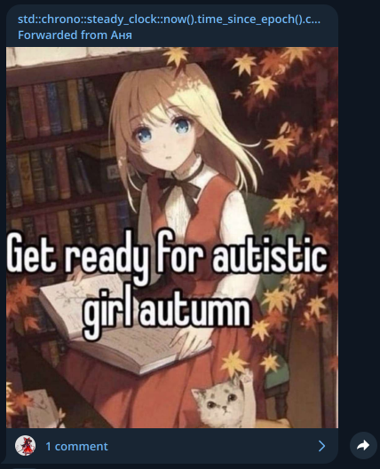
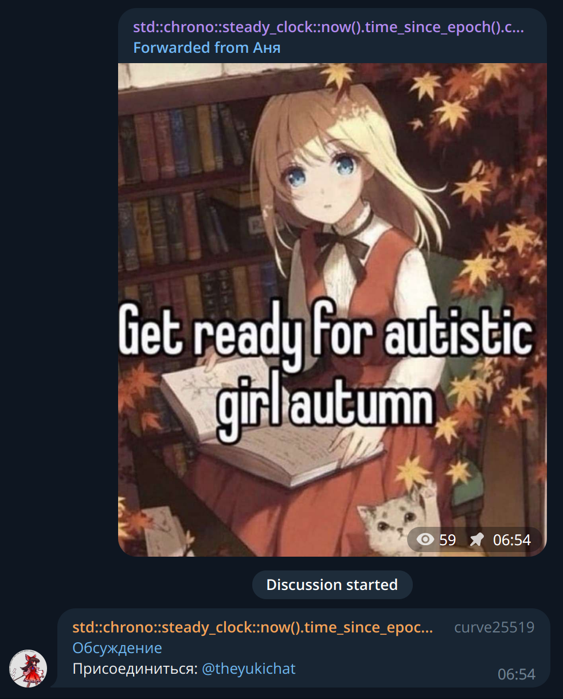
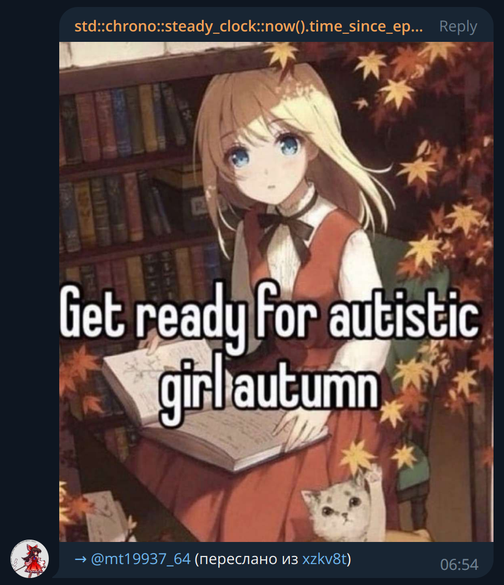

# chronobot

A bot for linking public Telegram channels to private discussion groups.

This userbot automatically forwards messages from a channel to a discussion group, linking the forwarded message to the original message and vice versa. From the user's perspective, the result looks like this:






## Running

Put `config.toml` to current working directory (using `config-sample.toml`) as an example and then run

```shell
$ cargo run
```
